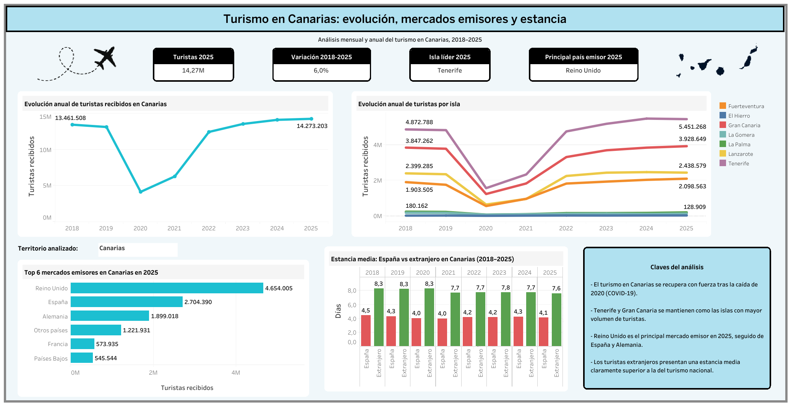

# Análisis del turismo en Canarias con Tableau

[Ver dashboard interactivo en Tableau Public](https://public.tableau.com/app/profile/raquel.yanes.rodr.guez/viz/analisis_turistico_Canarias/Dashboard1)

El análisis completo y la metodología utilizada se encuentran en [`docs/analisis.md`](docs/analisis.md).

Se incluye también una copia del [libro de trabajo de Tableau](tableau/analisis_turistico_Canarias.twbx).

## 1. Descripción del proyecto

Este proyecto tiene como objetivo analizar la evolución del turismo en Canarias mediante Python y Tableau. 

El análisis se desarrolla a partir de datos oficiales publicados por el Instituto Canario de Estadística (ISTAC) y estudia el comportamiento del turismo en Canarias entre 2018 y 2025, incorporando además información mensual disponible hasta julio de 2026.

A partir de estos datos se construye un dashboard interactivo que permite analizar la evolución del número de viajeros, comparar el comportamiento entre islas, identificar los principales mercados emisores y estudiar las diferencias en estancia media.

## 2. Preguntas a responder

Durante el desarrollo del proyecto se responden las siguientes preguntas:

- ¿Cómo ha evolucionado el número total de viajeros que llegan a Canarias entre 2018 y 2025?
- ¿Cómo ha evolucionado el número de viajeros en cada una de las islas?
- ¿Cuál es la variación porcentual entre los turistas registrados en 2018 y 2025 para cada isla?
- ¿Cómo evolucionan los principales mercados emisores entre 2025 y 2026?
- ¿Cuáles son los principales mercados emisores en 2025?
- ¿Cómo evoluciona el número total de pernoctaciones por isla?
- ¿Cómo evoluciona la estancia media por isla?
- ¿Qué diferencias existen entre la estancia media del turismo nacional y extranjero?

## 3. Fuente de datos

Los datos utilizados proceden del Instituto Canario de Estadística (ISTAC), organismo oficial de estadística de Canarias. El conjunto de datos incluye información mensual y anual sobre viajeros entrados, viajeros alojados, pernoctaciones y estancia media, desglosada por territorio y nacionalidad.

Fuente oficial:

https://datos.gob.es/es/catalogo/a05003423-pernoctaciones-viajeros-alojados-y-entrados-y-estancia-media-segun-principales-nacionalidades-islas-y-microdestinos-de-canarias-por-periodos

El dataset preparado para el análisis se incluye en la carpeta `/data`.

## 4. Herramientas

Para el desarrollo del proyecto se utilizan las siguientes herramientas:

- **Python (Pandas y NumPy):** preparación, limpieza, transformación y validación de los datos.
- **Tableau:** análisis visual, creación de campos calculados, parámetros y dashboard interactivo.
- **GitHub:** documentación y publicación final del proyecto.

## 5. Dashboard interactivo

El dashboard final se estructura en tres niveles:

- **KPIs generales:** número total de turistas en 2025, variación respecto a 2018, isla con mayor volumen turístico y principal mercado emisor.
- **Visualizaciones generales:** evolución anual del turismo en Canarias y comparación entre las siete islas.
- **Visualizaciones de detalle:** principales mercados emisores y estancia media según procedencia.

Se incorpora un parámetro interactivo que permite seleccionar Canarias o cualquiera de las siete islas. La selección actualiza las visualizaciones de detalle manteniendo el contexto general en los gráficos superiores.

## 6. Limitaciones

- La disponibilidad de datos mensuales no es homogénea entre nacionalidades.
- La categoría `Otros países o territorios del mundo (excluida España)` agrupa un volumen relevante de viajeros sin mayor desglose.
- Los datos de 2026 están disponibles únicamente hasta julio.
- Algunas combinaciones de territorio y nacionalidad presentan muy pocos viajeros, lo que puede producir valores extremos de estancia media.
